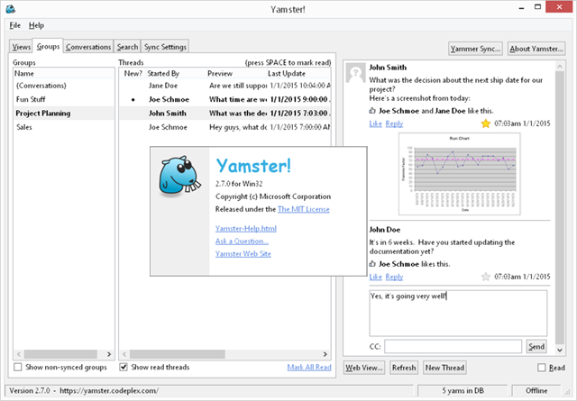
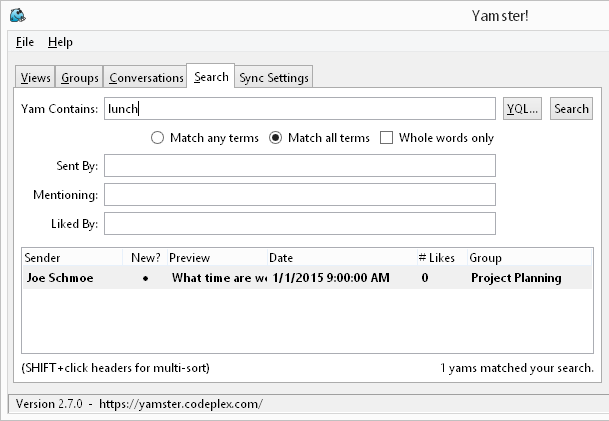
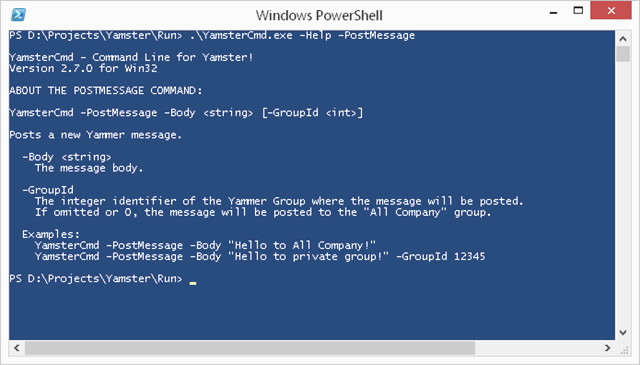
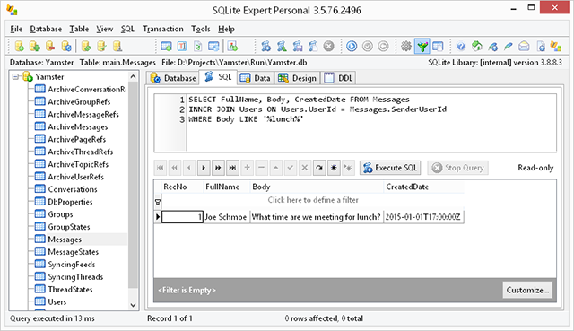

**Yamster!** is an open source desktop client and data mining tool for [Yammer](http://www.yammer.com), a popular private social network for businesses.

Yamster empowers you to:
* Save time by rapidly navigating discussions
* Download complete archives of Yammer groups for offline browsing
* Use advanced search criteria to find interesting historical conversations at your company
* Load and view CSV data dumps exported using Yammer's administrator control panel (experimental)
* Answer statistical questions about your social network using simple SQL queries
* For developers, build custom apps that leverage the Yamster engine to automate reading/posting/liking messages
Yamster uses the [Mono/Gtk](http://www.mono-project.com/GtkSharp) framework which supports multiple operating systems.  Currently only the Windows release is maintained, but Mac OS X or Linux releases may be provided again in the future if someone asks for it.

# History

Yamster originated at Microsoft as part of an internal "hackathon" event where employees are encouraged to create fun prototypes that explore new ideas.  The author continued development in his spare time and later obtained permission to release the project to the Yammer community under an open source license.  Yamster is not officially supported or maintained by Microsoft, but hopefully you will find it useful!  Suggestions and feedback are welcome.

> **Update June 2018:** Yamster was originally released on CodePlex.com, which is now defunct.  GitHub is now the official home for this project.

# Screenshots

 
_Yamster! application main window_

 
_Searching Yammer messages_

 
_Yamster command line interface_

 
_Using SQL to query the Yamster database_

# Documentation

For installation and usage instructions, see the [Yamster! Documentation](./Docs/Yamster-Instructions.md) page.
